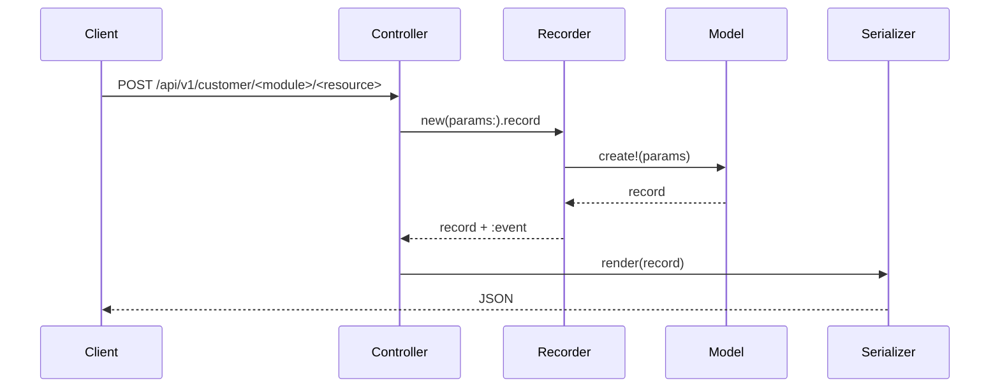

# Implementation Planner — core-web-api

## Input

**$ARGUMENTS** — Notion URL (e.g., `https://www.notion.so/workspace/Task-Title-abc123...`) or a Notion `page_id` (32-char hex).

If missing, abort with:
```
Usage: /api-dev:plan <notion-url-or-page-id>
```

---

## Step 1 — Validate environment

Run in parallel:
```bash
git branch --show-current
git status --porcelain
git fetch origin main --quiet
```

- If uncommitted changes → warn the user. Do not abort; ask if they want to stash or continue.
- Inform current branch — user decides if a new branch is needed.

---

## Step 2 — Fetch the Notion task

Extract the page ID from the URL (last 32-char hex segment) or use it directly if already an ID.

Call:
1. `mcp__notion__API-retrieve-a-page` with the `page_id` → get properties (title, status, ticket).
2. `mcp__notion__API-get-block-children` → get full body (description, acceptance criteria, any tables).

Extract from the page (**Notion template is fixed** — if a field is missing, mark it `⚠️ NOT SPECIFIED`). The heading names below are the **literal Spanish text** used in the Notion template at Kodim:

| Field | Where to find it |
|---|---|
| Title | `properties.title` or first `heading_1` |
| Description | Paragraph blocks under `Descripción` heading (literal Spanish name) |
| Acceptance Criteria | `bulleted_list_item` or `to_do` blocks under `Criterios de aceptación` heading (literal Spanish name) |
| Ticket ID | Explicit property, or regex on title (`KODIM-\d+`, `SC-\d+`) |

**Also extract env var mentions** in description and criteria:
- `SCREAMING_SNAKE_CASE` identifiers in code spans, code blocks, or plain text.
- Phrases like "agregar secret", "nueva API key", "variable de entorno", "Doppler", integration with third-party (Stripe, Twilio, etc.).
- Any new third-party integration implies ≥1 credential even if not named.

Save as `new_env_vars: [...]`. If none, record `new_env_vars: []`.

---

## Step 3 — Load context (mandatory)

Read these files IN FULL (they're curated and compact):

1. `${CLAUDE_PLUGIN_ROOT}/context/architecture.md`
2. `${CLAUDE_PLUGIN_ROOT}/context/recorders.md`
3. `${CLAUDE_PLUGIN_ROOT}/context/services.md`
4. `${CLAUDE_PLUGIN_ROOT}/context/controllers.md`
5. `${CLAUDE_PLUGIN_ROOT}/context/testing.md`
6. `${CLAUDE_PLUGIN_ROOT}/context/database.md`
7. `${CLAUDE_PLUGIN_ROOT}/context/rubocop.md`

Non-negotiable: the plan must align with these files. If you detect a conflict between the task and any rule, flag it in "Open Questions" — don't silently deviate.

---

## Step 4 — Explore the actual codebase

For each component inferred from the task, find an analogous existing file in the repo using `Glob` + `Grep` + `Read`:

| Component | Glob pattern |
|---|---|
| Model | `app/models/<module>/*.rb` |
| Recorder (Create) | `app/recorders/<module>/**/create_recorder.rb` |
| Recorder (Update) | `app/recorders/<module>/**/update_recorder.rb` |
| Recorder (Destroy) | `app/recorders/<module>/**/destroy_recorder.rb` |
| Service / Query | `app/services/<module>/**/*.rb` |
| LLM Tool | `app/services/kathy/llm/tools/**/*.rb` |
| Controller | `app/controllers/api/v1/<audience>/<module>/*_controller.rb` |
| Serializer | `app/serializers/<module>/*_serializer.rb` |
| Route | `config/routes/api/<audience>/<module>.rb` |
| Job | `app/jobs/<module>/*_job.rb` |
| Mailer | `app/mailers/<module>/*_mailer.rb` |
| Model spec | `spec/models/<module>/*_spec.rb` |
| Recorder spec | `spec/recorders/<module>/**/*_spec.rb` |
| Request spec | `spec/requests/api/v1/<audience>/<module>/*_spec.rb` |

**Every file in "Files to Create" must reference an analogue with `path:line_number`**. If no analogue exists in the same module, find one in another module and note it as a cross-reference.

Read 1-2 of the most relevant analogues in full. These anchor the plan in real code.

---

## Step 5 — Show analysis (visible, not internal)

Before writing the plan file, output this block:

```
### Analysis

- Title:             <Notion title>
- Ticket:            <KODIM-XXX | ⚠️ NOT SPECIFIED>
- Type:              [feature | bugfix | improvement | chore | test]
- Module:            [Core | Customer | Katalog | Kalendar | Kathy | Kommerce]
- Audience:          [admin | customer | kathy | multiple]
- Components:        [Model, Recorder, Service, Controller, Serializer, Job, Mailer, Decorator, LLM Tool, Migration, Route]
- Pattern chosen:    [e.g., Recorder + Controller + Blueprinter]
- Why:               [1–2 sentences]
- Async?:            [yes/no + reason]
- Migration?:        [yes/no + summary]
- New ENV vars:      [list or "None"]
- Diagram needed?:   [yes if: async job OR 3+ components in chain OR complex decision/state logic]
- Risks:             [anything ambiguous or needs clarification]
```

If there are critical open questions (missing acceptance criteria, ambiguous module, unclear audience), **stop here** and list them. Don't generate the plan — ask the user.

---

## Step 6 — Validate ENV vars statically (if any)

If `new_env_vars` is non-empty:

1. Read `config/deploy.yml` → check each var in `env.secret[]` or `env.clear{}`.
2. Read `.kamal/secrets` → check each var at the start of a line.

For each var:
- **Missing in `deploy.yml`** → mark as `❌ add to env.secret` (or `env.clear` if not sensitive).
- **Missing in `.kamal/secrets`** → mark as `❌ add line:` with:
  ```
  <VAR>=$(doppler secrets get <VAR> --project kodim-core-web-api --config prd --plain)
  ```
- **Present in both** → `✅ verified statically`. User must still confirm Doppler has it (`doppler secrets get <VAR> --config prd --plain`).

**ENV var sync is a silent deploy bug**: miss any of the three (Doppler, `deploy.yml`, `.kamal/secrets`) and the feature breaks in prod while the deploy goes green. This section is **blocking** in the plan.

---

## Step 7 — Write the plan

Create `plan-<ticket>-<slug>.md` in the current directory (e.g., `plan-KODIM-456-add-item-variants.md`). If no ticket, use the slug only with a `⚠️` prefix.

> **Quality bar**: the plan will be consumed by `api-dev:execute`. Every section must be precise enough that no implementation decision is left to guessing. Vague descriptions produce incorrect code.

---

### Plan template

````markdown
# Plan: <Title>

**Ticket:** <KODIM-XXX | ⚠️ NOT SPECIFIED>
**Source:** <Notion URL>
**Branch:** `<feature|bugfix|improvement|chore>/<slug>-<TICKET>`
**Type:** Feature | Bug | Chore | Refactor
**Module:** <Core|Customer|Katalog|Kalendar|Kathy|Kommerce>
**Audience:** <admin|customer|kathy>
**Complexity:** Low | Medium | High

---

## Summary

<2–3 sentences synthesizing the technical problem. Do not copy the Notion description.>

---

## Acceptance Criteria (from Notion)

- [ ] <criterion 1>
- [ ] <criterion 2>
- ...

---

## Technical Decision Record

- **Pattern:** <e.g., Recorder + Controller + Blueprinter / LLM Tool with confirmation / Query Service>
- **Why:** <1-2 sentences>
- **Async:** <yes/no — reason>
- **Trade-offs / risks:** <honest list>

---

## Flow Diagram

<Include ONLY if: async job OR 3+ components in chain OR complex decision logic. Omit otherwise.>



---

## Files to Read Before Implementing

Read these fully before writing any code.

| File | Why |
|------|-----|
| `app/recorders/<module>/<existing>/create_recorder.rb` | Reference Recorder pattern |
| `app/controllers/api/v1/<audience>/<module>/<existing>_controller.rb` | Reference Controller pattern |
| `spec/recorders/<module>/<existing>/create_recorder_spec.rb` | Reference spec with instance_double |
| `app/models/<module>/<existing>.rb` | Existing associations, concerns, validations |

---

## Files to Create

| File | Analogue |
|------|----------|
| `app/models/<module>/<resource>.rb` | `app/models/<module>/<similar>.rb:1` |
| `app/recorders/<module>/<resources>/create_recorder.rb` | `app/recorders/<module>/<similar>/create_recorder.rb:1` |
| `app/recorders/<module>/<resources>/update_recorder.rb` | `app/recorders/<module>/<similar>/update_recorder.rb:1` |
| `app/recorders/<module>/<resources>/destroy_recorder.rb` | `app/recorders/<module>/<similar>/destroy_recorder.rb:1` |
| `app/controllers/api/v1/<audience>/<module>/<resources>_controller.rb` | `app/controllers/api/v1/<audience>/<module>/<similar>_controller.rb:1` |
| `app/serializers/<module>/<resources>_serializer.rb` | `app/serializers/<module>/<similar>_serializer.rb:1` |
| `config/routes/api/<audience>/<module>.rb` (if not exists) | `config/routes/api/<audience>/<other>.rb:1` |
| `spec/models/<module>/<resource>_spec.rb` | `spec/models/<module>/<similar>_spec.rb:1` |
| `spec/recorders/<module>/<resources>/create_recorder_spec.rb` | `spec/recorders/<module>/<similar>/create_recorder_spec.rb:1` |
| `spec/requests/api/v1/<audience>/<module>/<resources>_spec.rb` | `spec/requests/api/v1/<audience>/<module>/<similar>_spec.rb:1` |
| `spec/factories/<module>/<resources>.rb` | `spec/factories/<module>/<similar>.rb:1` |

---

## Files to Modify

| File | Exact change |
|------|-------------|
| `config/routes.rb` | Add `draw("api/<audience>/<module>")` if new route file |
| `app/models/<parent_module>/<parent>.rb` | Add `has_many :<resources>, class_name: "<Module>::<Resource>"` if association needed |

---

## Database Migration

<Skip entirely if no migration needed>

```ruby
# File: db/migrate/<TIMESTAMP>_<action>_<target>.rb
# Action: create_table | add_column | add_index | etc.
# Reversible: yes

class CreateKatalogItemVariants < ActiveRecord::Migration[8.1]
  def change
    create_table :katalog_item_variants do |t|
      t.references :core_customer, null: false, foreign_key: { to_table: :core_customers }
      t.references :katalog_item, null: false, foreign_key: true
      t.string :name, null: false
      t.decimal :price_modifier, precision: 10, scale: 2, default: 0.0, null: false
      t.datetime :discarded_at

      t.timestamps
    end

    add_index :katalog_item_variants, :discarded_at
    add_index :katalog_item_variants, [:core_customer_id, :katalog_item_id, :name], unique: true
  end
end
```

**Post-migration**:
```bash
doppler run -- bin/rails db:migrate
doppler run --config test -- bin/rails db:test:prepare
doppler run -- bundle exec annotaterb models
```

**strong_migrations check**: <Confirmed safe / uses safe alternative: <describe> / safety_assured justified: <reason>>

---

## Environment Variables

<If `new_env_vars: []`, write: "No new environment variables introduced." and skip table.>

**BLOCKING**: if any var below is missing in Doppler, `config/deploy.yml`, OR `.kamal/secrets`, the deploy will succeed but the feature will break in production silently.

| Variable | Doppler (`dev`/`test`/`prd`) | `config/deploy.yml` | `.kamal/secrets` |
|---|---|---|---|
| `<VAR_1>` | ❓ verify: `doppler secrets get VAR_1 --config prd --plain` | ❌ add to `env.secret` / ✅ exists | ❌ add line / ✅ exists |

**To add to `.kamal/secrets`** (for missing vars):
```
<VAR>=$(doppler secrets get <VAR> --project kodim-core-web-api --config prd --plain)
```

---

## Business Rules

Exhaustive — if not listed, it won't be implemented.

- Rule 1: <e.g., Item variant price_modifier must be between -100.0 and 100.0>
- Rule 2: <e.g., A variant cannot be created for a discarded item>
- Rule 3: <e.g., Name must be unique scoped to (core_customer_id, katalog_item_id)>

---

## Failure Conditions

Every error path with the **exact** message string the user/client will receive.

| Condition | HTTP status | Error message |
|-----------|-------------|---------------|
| Validation fails | 422 | `{ error: record.errors.full_messages }` (handled by ExceptionsHandler) |
| Record not found | 404 | `{ error: "Record not found" }` (handled by ExceptionsHandler) |
| LLM Tool: resource not found | — (string response) | `"Resource not found. Please check the ID and try again."` |

---

## Side Effects (on success)

What happens after the happy path. If none, write "None."

- **Jobs**: <e.g., `Kommerce::OrderConfirmationJob.perform_later(order.id)` — passes ID, not object>
- **Emails**: <e.g., `Kommerce::OrderMailer.confirmation(order).deliver_later`>
- **Cache invalidation**: <if any>
- **Other**: <e.g., parent record updated>

---

## Spec Skeleton

> Executor writes these specs **first**, verifies RED (fail), then implements until GREEN.
> **Only model specs touch the DB** — all others use `instance_double`.
> Every assertion uses exact values (`eq(100.0)`, not `be_present`).

### `spec/models/<module>/<resource>_spec.rb` — **allowed to touch DB**

```ruby
require "rails_helper"

RSpec.describe Katalog::ItemVariant, type: :model do
  include_context 'core_customer'

  describe 'ActiveRecord Level' do
    describe 'associations' do
      it { should belong_to(:core_customer) }
      it { should belong_to(:katalog_item) }
    end

    describe 'validations' do
      subject { build(:katalog_item_variant, core_customer: core_customer) }

      it { should validate_presence_of(:name) }
      it { should validate_uniqueness_of(:name).scoped_to(:core_customer_id, :katalog_item_id) }
      it { should validate_numericality_of(:price_modifier).is_greater_than_or_equal_to(-100.0).is_less_than_or_equal_to(100.0) }
    end
  end

  describe 'Database Level' do
    it { should have_db_index(:discarded_at) }
    it { should have_db_index([:core_customer_id, :katalog_item_id, :name]).unique(true) }
  end

  describe 'concerns' do
    it { should include_concern(Discardable) }
    it { should include_concern(Ransackable) }
  end

  describe 'factories' do
    it { expect(build(:katalog_item_variant, core_customer: core_customer)).to be_valid }
  end
end
```

### `spec/recorders/<module>/<resources>/create_recorder_spec.rb` — **instance_double only**

```ruby
require "rails_helper"

RSpec.describe Katalog::ItemVariants::CreateRecorder do
  subject(:recorder) { described_class.new(params: params) }

  let(:params) { { name: "Large", price_modifier: 10.0, katalog_item_id: 1 } }
  let(:variant) { instance_double(::Katalog::ItemVariant) }

  describe '#record' do
    it 'creates the variant, returns the record and adds the event' do
      expect(::Katalog::ItemVariant).to receive(:create!).with(params).and_return(variant)

      expect { expect(recorder.record).to eq(variant) }
        .to change { recorder.events }.from([]).to([:katalog_item_variant_created])
    end

    it 'propagates the error and does not add events when create! fails' do
      error = ActiveRecord::RecordInvalid.new(::Katalog::ItemVariant.new)
      expect(::Katalog::ItemVariant).to receive(:create!).with(params).and_raise(error)

      expect { recorder.record }.to raise_error(error.class)
      expect(recorder.events).to be_empty
    end
  end
end
```

### `spec/requests/api/v1/<audience>/<module>/<resources>_spec.rb` — **Unit approach (no DB)**

```ruby
require "rails_helper"

RSpec.describe "API V1 Customer Katalog ItemVariants", type: :request do
  before do
    host! 'test.example.com'
    allow_any_instance_of(::ApplicationController).to receive(:set_current_user).and_return(true)
    allow_any_instance_of(::ApplicationController).to receive(:set_tenant).and_return(true)
  end

  describe "POST /api/v1/customer/katalog/item_variants" do
    let(:variant) { instance_double(::Katalog::ItemVariant, id: 1) }
    let(:recorder) { instance_double(::Katalog::ItemVariants::CreateRecorder, record: true, katalog_item_variant: variant) }

    it "delegates to recorder and returns 201 with serialized JSON" do
      expect(::Katalog::ItemVariants::CreateRecorder).to receive(:new)
        .and_return(recorder)
      expect(::Katalog::ItemVariantsSerializer).to receive(:render)
        .with(variant).and_return('{"id":1}')

      post "/api/v1/customer/katalog/item_variants",
           params: { katalog_item_variant: { name: "Large", price_modifier: 10.0, katalog_item_id: 1 } }

      expect(response).to have_http_status(:created)
      expect(response.body).to eq('{"id":1}')
    end
  end

  describe "GET /api/v1/customer/katalog/item_variants/:id (not found)" do
    it "returns 404" do
      allow(::Katalog::ItemVariant).to receive_message_chain(:active, :find).and_raise(ActiveRecord::RecordNotFound)
      get "/api/v1/customer/katalog/item_variants/999"
      expect(response).to have_http_status(:not_found)
    end
  end
end
```

### Factory

```ruby
# spec/factories/<module>/<resources>.rb
FactoryBot.define do
  factory :katalog_item_variant, class: 'Katalog::ItemVariant' do
    association :core_customer
    association :katalog_item, core_customer: -> { core_customer }

    sequence(:name) { |n| "Variant #{n}" }
    price_modifier { 0.0 }

    trait :discarded do
      discarded_at { Time.current }
    end
  end
end
```

---

## Implementation Steps

Ordered. Each step is atomic. Executor runs specs after each step.

### Step 1: Migration

**Goal:** Create `katalog_item_variants` table with tenant FK, item FK, and discarded_at.
**Files:** `db/migrate/<TIMESTAMP>_create_katalog_item_variants.rb`

Run: `doppler run -- bin/rails db:migrate`, `doppler run -- bundle exec annotaterb models`.

### Step 2: Model

**Goal:** Create `Katalog::ItemVariant` with `acts_as_tenant`, Discardable, Ransackable.
**Files:** `app/models/katalog/item_variant.rb`

```ruby
class Katalog::ItemVariant < ApplicationRecord
  acts_as_tenant(:core_customer, class_name: "Core::Customer", foreign_key: :core_customer_id)

  include Discardable
  include Ransackable

  belongs_to :katalog_item, class_name: "Katalog::Item"

  validates :name, presence: true, uniqueness: { scope: [:core_customer_id, :katalog_item_id] }
  validates :price_modifier, numericality: { greater_than_or_equal_to: -100.0, less_than_or_equal_to: 100.0 }
end
```

Run spec: `doppler run --config test -- bundle exec rspec spec/models/katalog/item_variant_spec.rb`

### Step 3: Factory

**Goal:** Create factory with traits.
**Files:** `spec/factories/katalog/item_variants.rb`

### Step 4: Recorders

**Goal:** Create, Update, Destroy recorders with single operation + event.
**Files:** `app/recorders/katalog/item_variants/{create,update,destroy}_recorder.rb`

Run specs: `doppler run --config test -- bundle exec rspec spec/recorders/katalog/item_variants/`

### Step 5: Serializer

**Goal:** Blueprinter serializer (plural name).
**Files:** `app/serializers/katalog/item_variants_serializer.rb`

### Step 6: Controller

**Goal:** CRUD controller inheriting from `::ApplicationController`, delegating to recorders.
**Files:** `app/controllers/api/v1/customer/katalog/item_variants_controller.rb`

### Step 7: Routes

**Goal:** Add route in customer/katalog.rb.
**Files:** `config/routes/api/customer/katalog.rb` (append).

### Step 8: Request spec

**Goal:** Unit approach with mocks.
**Files:** `spec/requests/api/v1/customer/katalog/item_variants_spec.rb`

Run full suite: `doppler run --config test -- bundle exec rspec spec/ --format documentation`

### Step 9: Coverage + lint

```bash
doppler run --config test -- COVERAGE=true bundle exec rspec
doppler run --config test -- bundle exec undercover --compare origin/main
doppler run --config test -- bundle exec rubocop -A
```

Undercover must report 0 uncovered lines. Rubocop must be clean.

---

## Checklist

- [ ] Specs written BEFORE implementing (RED before GREEN)
- [ ] All Business Rules covered by specs
- [ ] All Failure Conditions return exact messages from the table
- [ ] Side effects tested with `have_enqueued_job` / `have_enqueued_mail`
- [ ] `acts_as_tenant` declared on all new tenant-scoped models
- [ ] `Discardable` + `Ransackable` concerns included where applicable
- [ ] `discard!` used, never `destroy!`
- [ ] `core_customer_id` NOT in `permit()` — comes from tenant
- [ ] Every spec except model specs uses `instance_double` — no `create(:factory)` in non-model specs
- [ ] Multi-tenant isolation test included for each component touching tenant-scoped models
- [ ] `doppler run --config test -- bundle exec rspec` passes
- [ ] `doppler run --config test -- bundle exec undercover --compare origin/main` clean (no uncovered diff lines)
- [ ] `doppler run --config test -- bundle exec rubocop` clean
- [ ] `.rubocop_todo.yml` NOT modified
- [ ] Coverage ≥ 85%
- [ ] `bin/ci` green
- [ ] Migration reversible; `annotaterb` run and committed
- [ ] ENV vars (if any) exist in Doppler (`prd`) AND declared in `config/deploy.yml` AND `.kamal/secrets`
- [ ] Commit: `[<TYPE>] <short title> - <TICKET>`
- [ ] PR against `main`

---

## Open Questions

<Real blockers only. Omit if none.>

- <e.g., "Acceptance criterion #3 says 'notify admin' — via email or WhatsApp? Blocks Side Effects decision.">
````

---

## Step 8 — Confirm and present

After writing the plan file, output:

```
### Plan written

File:     plan-<TICKET>-<slug>.md
Branch:   <feature|bugfix|...>/<slug>-<TICKET>
Module:   <module>
Audience: <audience>

Top 3 decisions:
  1. <e.g., "Using Recorder + Controller pattern with Blueprinter serializer (analogous to Katalog::Categories).">
  2. <e.g., "New table katalog_item_variants scoped to (core_customer, katalog_item). Migration included.">
  3. <e.g., "No ENV vars introduced.">

Diagram generated: <yes + reason | no>

Sections needing human refinement before executor:
  - <e.g., "Open Question about notification channel for admin.">
  - <...>

Next step:
  Review the plan file. If OK, run:
    /api-dev:execute plan-<TICKET>-<slug>.md
```

**Stop here.** Do not create branch, do not create files, do not modify anything. Wait for the user.

---

## Hard rules

- **Never implement anything with just the plan** — only planning. Implementation happens via `api-dev:execute`.
- **Always anchor each file to a real analogue** with `path:line`. If no analogue, mark explicitly and propose cross-module reference.
- **Always validate against the 7 context files**. If a plan conflicts with a rule, flag in "Open Questions".
- **Never invent a ticket ID**. If not in Notion, mark `⚠️ NOT SPECIFIED` and warn the commit will require one before PR.
- **Never skip acceptance criteria**. Each must map to at least one line in the plan (file, test, rule).
- **Read in parallel** when searching multiple analogues — emit multiple `Glob`/`Read` in a single turn.
- **If the module doesn't exist** (new module), mark as blocker in "Open Questions" and propose analogue from another module.
- **ENV vars are a silent deploy bug**: Step 6 reads `config/deploy.yml` and `.kamal/secrets` directly and marks missing vars as blocking.
- **Spec skeleton MUST use `instance_double` for non-model specs**. Never `create(:factory)` outside model specs.
